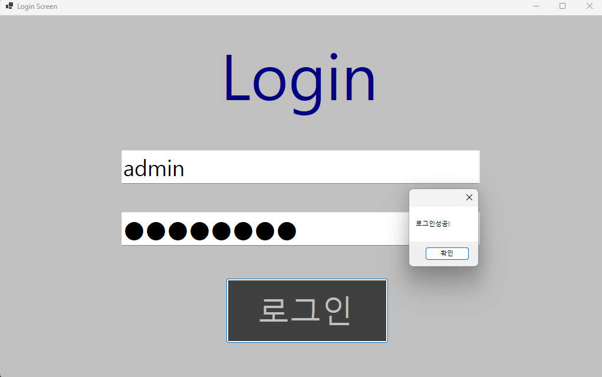

# (C# 코딩) 로그인 스크린

## 개요- C# 프로그래밍 학습
- 1줄 소개: 사용자의 아이디와 패스워드를 입력받는 로그인 화면
- 사용한 플랫폼:
  - C#, .NET Windows Forms, Visual Studio, GitHub
- 사용한 컨트롤:
  - Label, TextBox , Button
-사용한 기술과 구현한 기능:
  -Visual Studio를 이용하여 UI디자인
  -패스워드 입력 내요를 숨기는 기능 구현
  -Placeholer 기능 구현
  -탭을 이용한 입력 포커스 제어

## 실행 화면 (과제1)
- 과제1 코드의 실행 스크린샷

  

- 과제 내용:
	- Label(표시),TextBox(입력),Button(버튼)을 적절히 배치합니다.
	- TextBox의 Placeholer 기능을 구현합니다.
	- 아이디와 패스워드 입력 받아 확인합니다.

- 구현 내용과 기능 설명
   - 처음 실행시 입력 포커스가 버튼으로 가도록 조정하였습니다.
   - 아이디와 패스워드를 입력 받는 창에는 안내 문구가 표시되도록 구현하였습니다.
   - 로그인 버튼 클릭 시 입력값을 변수에 저장 후, 미리 설정한 계정 정보와 비교
   - 비밀번호 입력 시 `UseSystemPasswordChar` 속성을 사용하여 보안 처리 구현